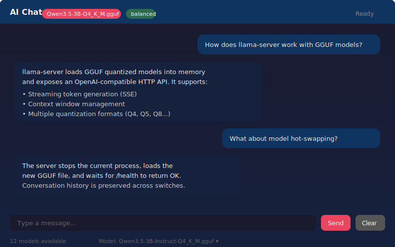

# LLM Test Bed

> Local AI chat, model comparison, and swarm testing — all running on your machine with [llama.cpp](https://github.com/ggml-org/llama.cpp).

---

## What It Does

LLM Test Bed is a self-contained toolkit for running, chatting with, and benchmarking local LLM models (GGUF format). It provides three main components:

| Component | What It Does | How to Run |
|-----------|-------------|------------|
| **AI Chat** | Full-featured chat UI with streaming responses, multi-turn conversations, and runtime model switching | `python chat.py` |
| **Model Comparator** | Send the same prompt to multiple local + cloud models, compare speed/quality/resource usage side-by-side | `python comparator_backend.py` + open `model_comparator.html` |
| **Swarm Test Dashboard** | Arena (head-to-head), Benchmark (multi-level), Marathon (multi-round) testing with judge evaluation | `python swarm/server_with_swarm.py` |

---

## How It Works with AI Chat Bot

```
┌──────────────┐     HTTP/SSE      ┌───────────────┐     OpenAI API     ┌──────────────┐
│   Browser UI │ ◄──────────────► │  FastAPI/Python │ ◄───────────────► │ llama-server │
│  (embedded)  │   /v1/chat/...   │   (chat.py)    │   localhost:8888  │  (.exe/bin)  │
└──────────────┘                  └───────────────┘                    └──────────────┘
                                         │                                    │
                                    Manages:                             Loads GGUF
                                  • Sessions                            model files
                                  • History                             from C:\AI\Models
                                  • Model switching
```

### The Flow

1. **`python chat.py`** starts FastAPI + Uvicorn on port 8080
2. It auto-discovers all `.gguf` models in `C:\AI\Models` (and other configured directories)
3. It picks the best model (prefers Qwen 3.5, Llama 3.2, Phi 3.5) and launches `llama-server` on port 8888
4. The embedded browser UI opens automatically — dark-themed chat interface with message bubbles
5. Messages are sent via `/__chat_stream` endpoint → forwarded to llama-server's OpenAI-compatible API
6. Tokens stream back via Server-Sent Events (SSE) and appear in real-time in the chat bubble
7. Multi-turn conversation history is maintained per session (up to 20 turns)

### Key Features

- **Real-time streaming** — tokens appear as they're generated, no waiting for full response
- **Smart model selection** — auto-picks the best model based on name patterns and size
- **Hot model switching** — swap models from the footer dropdown without restarting
- **OpenAI-compatible API** — `POST /v1/chat/completions` works with any OpenAI client library
- **Qwen 3.5 reasoning support** — separates `reasoning_content` from `content` tokens, falls back to reasoning if no content produced
- **Zero configuration** — just place `.gguf` files in `C:\AI\Models` and run

---

## UI Preview

<p align="center">
  
</p>

*Dark-themed chat interface with model selector, streaming responses, and conversation history.*

---

## Model Comparator

The comparator lets you benchmark multiple models against the same prompt:

- **Local models** — select up to 6 GGUF models from your library
- **Cloud models** — configure OpenAI (GPT-4), Anthropic (Claude), Google (Gemini) API keys
- **Judge model** — optionally have another model rate all responses for relevance, accuracy, and clarity
- **Hardware detection** — auto-detects CPU (AVX2/AVX-512), GPU (NVIDIA/AMD), and recommends the optimal llama.cpp build
- **File comparison** — load a file and ask all models to analyze it
- **Model download** — download GGUF models from HuggingFace, ModelScope, Ollama, or GitHub directly from the UI

---

## Swarm Testing (ZenAIos)

The `swarm/` directory contains a full AI hospital management dashboard with built-in LLM testing:

- **Arena** — head-to-head comparison between two models
- **Benchmark** — multi-level stress testing with varying complexity
- **Marathon** — multi-round endurance testing with consistency analysis
- **Evaluation scoring** — automated judge with weighted criteria
- **7 languages** — EN, RO, HU, DE, FR, Hebrew (RTL), Japanese
- **Activity tracking** — SQLite database logs every interaction
- **Adaptive FIFO buffers** — admission control with backpressure for production workloads

---

## Project Structure

```
LLM_TEST_BED/
├── chat.py                  # AI Chat — FastAPI server + embedded UI
├── comparator_backend.py    # Model Comparator backend (port 8123)
├── model_comparator.html    # Model Comparator frontend
├── requirements.txt         # Python dependencies (fastapi, uvicorn, httpx)
├── Run_me.bat               # One-click Windows launcher
├── bin/                     # llama-server executable + DLLs (gitignored)
├── screenshots/             # UI screenshots
├── swarm/                   # ZenAIos dashboard + swarm testing
│   ├── server_with_swarm.py # Smart dev server with activity tracking
│   ├── swarm_bridge.py      # Bridge to Local_LLM inference engine
│   ├── swarm-test.html      # Swarm test dashboard UI
│   ├── index.html           # Hospital dashboard
│   ├── app.js, chat.js      # Frontend logic
│   └── tests/               # Browser + Python test suites
├── _rustified/              # Rust port experiments
└── patches/                 # llama-cpp-python patches (gitignored)
```

---

## Quick Start

### Prerequisites

- **Python 3.10+**
- **llama-server** executable — download from [llama.cpp releases](https://github.com/ggml-org/llama.cpp/releases), place in `bin/`
- **GGUF models** — place in `C:\AI\Models` (or set `SWARM_MODELS_DIR` env var)

### Install & Run

```bash
# Install dependencies
pip install -r requirements.txt

# Run AI Chat (auto-opens browser)
python chat.py

# Or use the Windows launcher
Run_me.bat

# Run Model Comparator (separate tool)
python comparator_backend.py
# Then open model_comparator.html in your browser

# Run Swarm Dashboard
cd swarm
python server_with_swarm.py
```

### Command-Line Options

```bash
python chat.py                         # auto-detect everything
python chat.py --model path/to.gguf    # specific model
python chat.py --port 9090             # custom UI port
python chat.py --no-browser            # headless mode
```

---

## API Endpoints

### AI Chat (`chat.py` — port 8080)

| Method | Endpoint | Description |
|--------|----------|-------------|
| GET | `/` | Embedded chat UI |
| GET | `/health` | Server health + model status |
| GET | `/v1/models` | List available models (OpenAI-compatible) |
| POST | `/v1/chat/completions` | Chat completions (OpenAI-compatible, streaming supported) |
| POST | `/__chat` | Simple chat (returns full response) |
| POST | `/__chat_stream` | Streaming chat (SSE tokens) |
| POST | `/__switch` | Hot-swap to a different model |
| POST | `/__clear` | Clear conversation history |
| GET | `/__status` | UI status (model, category, all models) |

### Model Comparator (`comparator_backend.py` — port 8123)

| Method | Endpoint | Description |
|--------|----------|-------------|
| GET | `/__system-info` | CPU, GPU, RAM, models, llama.cpp recommendation |
| POST | `/__comparison/mixed` | Run comparison across local + online models |
| POST | `/__download-model` | Download a GGUF model (background job) |
| GET | `/__download-status?job=ID` | Check download progress |

---

## License

MIT
